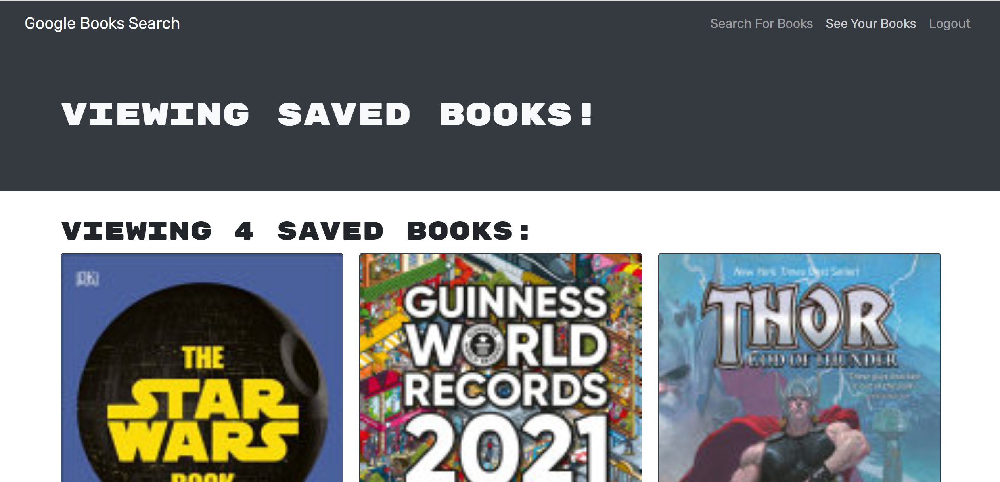

# Portfolio

## Description 
This application allows the user to search for books they wish to purchase and keep a running list of them. The user has the ability to log in/out, sign up, and save and delete books as they see fit. The original starter code was weitten as a RESTful API, and our assignment was to refactor the code and set up an Apollo server that would use GraphQL queries and mutations to fetch and modify the data, replacing the existing RESTful API.   

## Deployed at Heroku here:

https://ancient-temple-93440.herokuapp.com/

### Built With 

 * React
 * Express.js
 * Node.js
 * MongoDB
 * Mongoose
 * GraphQL API
 * Apollo
 * Google Book API
 

